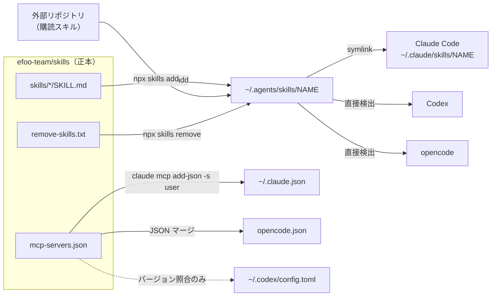

# efoo-team/skills

Shared agent skills for efoo-team.

正本として保有するもの:

| 資産 | 正本 | 配布先 |
|---|---|---|
| 共通層 Agent Skills | `skills/<name>/SKILL.md` | `~/.agents/skills/` → Claude Code / Codex / opencode |
| global MCP サーバー定義 | `mcp-servers.json` | `~/.claude.json`（user スコープ）/ `opencode.json` |

`MCP-REGISTRY.md` は project スコープを含む全 MCP サーバーの台帳。スキルの横断台帳は持たない。

## セットアップ

```bash
ghq get efoo-team/skills
bash ~/ghq/github.com/efoo-team/skills/setup.sh
```

Node.js 18 以上が必要。`npx skills` が `~/.claude/skills/` へ書き込むため、設定リポジトリ（「関連リポジトリ」節）の配置を先に済ませる。

clone せずに `curl -fsSL https://raw.githubusercontent.com/efoo-team/skills/main/setup.sh | bash` でも実行できるが、post-merge hook が設定されないため以降の自動反映は受けられない。

## スキル一覧

30 本（うち explicit-only 18 本）。外部購読は `code-debug-skill`（`abekdwight/code-debug-skills`）の 1 本。

トリガー列の `auto` は description に基づく自動発動、`explicit-only` は `/<name>`（Codex では `$<name>`）による明示起動のみを意味する。

| カテゴリ | スキル | 用途 | トリガー |
|---|---|---|---|
| 要件・計画・実行 | `pre-define` | 曖昧な要望を `/define` の入力へ具体化 | explicit-only |
| | `define` | 詳細要件定義 | explicit-only |
| | `plan-explain` | 計画ファイルの構造化要約 | explicit-only |
| | `review-plan` | 実装計画の多観点レビュー | explicit-only |
| | `execute` | 複雑なタスクのオーケストレーションと委譲 | explicit-only |
| 設計判断 | `module-boundary-design` | モジュール境界と責務分割の設計判断 | auto |
| | `refactor-mindset` | 変更容易性を高める再構成 | auto |
| | `restful-api-design` | Web / HTTP API の設計判断 | auto |
| | `ui-ux-design` | UI・画面・導線の設計判断（検討手順・入口統合・段階的開示・配置。ビジュアル表現は対象外） | auto |
| | `database-design` | DB のテーブル・カラム命名 | auto |
| | `sql-writing-style` | 一瞥して読める SQL のスタイルルール | auto |
| PR・issue 運用 | `issue-report-user` | 非エンジニアの複数ケース報告を並列調査し、競合しない issue へグルーピングして起票 | explicit-only |
| | `issue-report-dev` | ログ・スタックトレースから根本原因を調査し、原因仮説・修正方針・受入条件つきで起票 | explicit-only |
| | `pr` | ブランチ作成から PR までの一連 | explicit-only |
| | `pr-stage` | `pr` の薄型ラッパー（ステージ済みの変更のみ） | explicit-only |
| | `pr-body` | 階層化された PR 本文の生成 | explicit-only |
| | `review-pr-check` | PR レビュー対応のトリアージ | explicit-only |
| | `dependabot-sweep` | Dependabot PR の統合 | explicit-only |
| エージェント基盤 | `agent-harness-engineering` | AI エージェント・ハーネスの設計憲章 | auto |
| | `agent-native-project-design` | ハーネス上で動くリポジトリ側の設計（指示ファイル・スキル・hooks） | auto |
| | `create-skill` | 新規スキルの対話的作成 | explicit-only |
| | `agents-md-sync` | AGENTS.md 階層の生成・更新 | explicit-only |
| | `formation-designer` | oh-my-openagent のフォーメーション設計（opencode 限定） | auto |
| Mastra | `mastra-ai-architecture-rules` | Mastra ベース AI サービスの責務分離 | auto |
| | `mastra-framework-guide` | Mastra の現行 API 検証とバージョン移行 | auto |
| 調査・保守 | `ask` | 編集を行わない read-only の分析と回答 | explicit-only |
| | `search-history` | Claude Code / Codex の会話履歴検索 | explicit-only |
| | `documentation-sync` | git diff 起点のドキュメント整合検証 | auto |
| | `cleanup-storage` | ディスク使用量の調査とカテゴリ別承認による削除 | explicit-only |
| | `orca-automations` | orca CLI 経由の定期 automation 管理 | explicit-only |

## MCP サーバー定義

正本は `mcp-servers.json`、現在は `playwright`（`@playwright/mcp@0.0.78`）のみ。`sync-mcp.sh` が Claude Code（user スコープ）と opencode へ配布し、Codex は照合のみ行う（Codex 側の正本は `codex-code-setting/config.shared.toml`）。

- バージョン変更は `pin` と `definition.args` を同時に更新する。片方だけの half-bump は sync が検出して停止する。Codex 側も同版に揃える。手順は `MCP-REGISTRY.md`。
- 配布対象から外すときは `servers` から消し、`retired` 配列へ名前を追加する。

## 配布の仕組み



`~/.agents/skills/` が 3 ツールの合流点。Claude Code のみ per-skill の symlink を必要とし、Codex と opencode は直接検出する。

`setup.sh` は team-owned → エージェント限定（opencode のみの `formation-designer`）→ 外部購読の順にインストールし、`remove-skills.txt` の名前を削除して MCP を同期する。冪等であり、変更のないスキルはハッシュ比較でスキップする。

初回実行時に `core.hooksPath` が設定され、以降は `git pull` が `setup.sh` を再実行する。**push は全メンバーのマシンでの即時実行を意味するため、このリポジトリは PR 運用とする。**

## 正本と編集先

配布先を直接編集すると次回の配布で上書きされるか、正本と乖離したまま残る。変更は必ず正本に対して行う。

| 資産 | 正本 | 反映経路 | 直接編集しない |
|---|---|---|---|
| 共通層スキル | `skills/<name>/` | `setup.sh` → `~/.agents/skills/` | `~/.agents/skills/`、各ツールの `skills/` symlink |
| 外部購読スキル | upstream リポジトリ（購読の記録は `setup.sh` の行） | 同上 | `~/.agents/skills/` の実体（変更は upstream へ PR） |
| プロジェクト層スキル | 各プロジェクトの `.agents/skills/<name>/` | `.claude/skills/<name>` のコミット済み相対 symlink | `.claude/skills/` への実体配置 |
| global MCP 定義 | `mcp-servers.json` | `sync-mcp.sh` → `~/.claude.json` / `opencode.json` | 配布先の両ファイル、`claude mcp add -s user` |
| project MCP 定義 | 各プロジェクトの `.mcp.json` | そのリポジトリの git | — |
| ローカル状態 | —（マシン固有） | `~/.agents/.skill-lock.json` / `.mcp-sync-state.json` | どのリポジトリにもコミットしない |

規約の正本は `AGENTS.md`。新規作成は `/create-skill`（Codex では `$create-skill`）を使う。

スキルの正本は共通層（このリポジトリ）とプロジェクト層（各リポジトリの `.agents/skills/`）の 2 か所のみ。迷ったらプロジェクト層に作り、2 つ目のプロジェクトで必要になった時点で昇格する。共通層と同名をプロジェクト層に置かない（シャドウするため）。

## スキルのトリガー区分

auto は description に基づいて自動発動し、全セッションでコンテキストを消費する。explicit-only は `/<name>` でのみ起動する。

| ツール | 明示起動 | explicit-only の実現手段 | description の消費 |
|---|---|---|---|
| Claude Code | `/<name>` | frontmatter `disable-model-invocation: true` | ゼロ |
| Codex | `$<name>` | `agents/openai.yaml` の `policy.allow_implicit_invocation: false`（frontmatter は認識されない） | ゼロ |
| opencode | `/<name>` | 未対応（両フィールドとも無視される） | 常時 |

explicit-only は次の 3 点をすべて揃える。1 つでも存在すれば `check-skills.py` が残りを要求する。

1. frontmatter の `disable-model-invocation: true`
2. `agents/openai.yaml` の `policy.allow_implicit_invocation: false`
3. description 冒頭の門番文 `Only use when the user explicitly invokes /<name> (or $<name> in Codex). Never auto-invoke.`

例外は auto かつ `metadata.internal: true` のスキル（現在 `formation-designer`）で、2 のみを持ち Codex への暗黙起動を塞ぐ。

## 関連リポジトリ（Repository landscape）

各ツールの設定は専用リポジトリで管理し、その clone をツールの設定ディレクトリとして配置する（手順は各リポジトリの `SETUP.md`）。スキルはどの設定リポジトリでも管理せず、ここへ集約する。各設定リポジトリは自分の `skills/` を gitignore している。

| リポジトリ | 配置先 | 管理対象 |
|---|---|---|
| `efoo-team/claude-code-setting` | `~/.claude` | `settings.json`、`commands/`、`agents/`、`CLAUDE.md` |
| `efoo-team/codex-code-setting` | `~/.codex` | `config.shared.toml`、`AGENTS.md`、`automations/`、`scripts/` |
| `efoo-team/opencode-setting` | `~/.config/opencode` | `formations/`、`agents/`、`prompts/`、`tui.json` |
| `efoo-team/skills`（本リポジトリ） | `~/.agents/skills/` へ配布 | 共通層スキル、global MCP 定義、MCP 台帳 |

### 3 ツール同等性の原則

1 つの設定リポジトリへ変更を加えるときは、他 2 ツールへも適用すべきかを確認し、適用する場合は同じ作業の中で揃える。意図的に 1 ツールへ閉じる場合は理由をコミットメッセージまたは PR へ明記する。

| 設定の種類 | Claude Code | Codex | opencode |
|---|---|---|---|
| グローバル指示ファイル | `CLAUDE.md` | `AGENTS.md` | `AGENTS.md`（意図的に最小） |
| 共有設定（モデル・env・permission） | `settings.json` | `config.shared.toml` | `opencode.json`・`tui.json` |
| MCP（横断・同期対象） | `mcp-servers.json` | `config.shared.toml`（pin を同版に） | `mcp-servers.json` |
| MCP（ツール限定） | `.mcp.json` / `~/.claude.json` | `config.shared.toml` | `opencode.json` |
| スキル | 本リポジトリで共通管理 | 同左 | 同左 |
| サブエージェント / ペルソナ | `agents/*.md` + `commands/` | `agents/*.toml` | `formations/` + `agents/*.md` + `prompts/` |
| 自動実行フック | `settings.json` の `hooks` | `~/.codex/hooks.json`（未追跡） | — |

### ライブ設定リポジトリの git 運用規律

- **pull はデプロイである。** post-merge hook が配布・生成を自動実行する。
- **ワーキングツリーの dirty は仕様である。** 意図した変更だけを外科的にステージし、`git add -A` / `git stash` / `git checkout .` / `git clean` で巻き戻さない（稼働中セッションの状態を破壊する）。
- 設定リポジトリ 3 つは main 直コミット、本リポジトリは PR 運用とする。

## ファイル構成

```
AGENTS.md                  # スキル管理ルールの正本
DOCTOR.md                  # 月次ヘルスチェックの手動チェックリスト
MCP-REGISTRY.md            # 全 MCP サーバーの台帳（バージョン更新手順を含む）
mcp-servers.json           # global MCP サーバー定義の正本
remove-skills.txt          # setup.sh が削除対象として扱うスキル名一覧
setup.sh                   # スキルの一括インストール
sync-mcp.sh                # MCP 定義同期の入口（setup.sh から自動実行）
hooks/post-merge           # git pull 時に setup.sh を再実行する git hook
scripts/check-skills.py    # スキル規約の検査（手動実行）
scripts/sync-mcp.mjs       # MCP 同期の実体
skills/                    # 共通層スキルの実体
```

`check-skills.py` は frontmatter lint・description 類似度・explicit-only 3 点整合・description 予算・コア公理等価の 5 つを検査する（報告のみで修正はしない）。最重要は YAML パースゲートで、skills CLI はパースに失敗した SKILL.md を無言でスキップするため、壊れた frontmatter は気付かれずに配布から脱落する。

## コンテキスト予算

auto スキルの description は常時コンテキストを消費する。スキル一覧の予算はコンテキストウィンドウの 2%（Codex）/ 1%（Claude Code）で、超過すると description の切り詰めやスキルの除外が起きる。

チーム側の規律は `check-skills.py` が強制するが、個人環境のプラグインと購読スキルは統制外であり、警告が出た場合の主因はほぼそちらにある。Claude Code は `/doctor` と `/context` で状況を確認でき、`settings.json` の `skillListingBudgetFraction` / `skillOverrides` で調整する。Codex は `~/.codex/config.toml` で無効化する（要再起動）。

```toml
[plugins.<plugin-name>]
enabled = false

[[skills.config]]
name = "<skill-name>"
enabled = false
```
