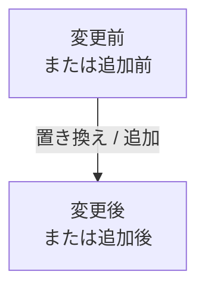
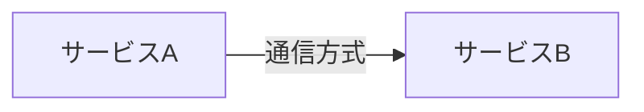
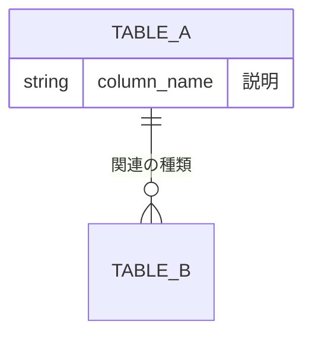
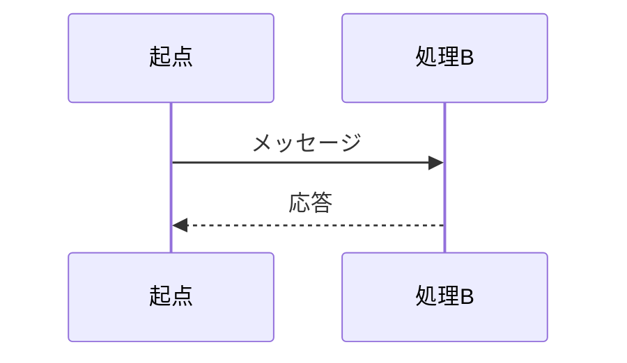

# plan-explain - 計画ファイルの人間向け要約

## 目的

指定された計画ファイル（`.sisyphus/plans/` 配下など）を読み込み、その計画が何を行うものかを人間が即座に把握できる形で要約する。

**成果物**: コンソール出力としての構造化された要約レポート

## 基本方針

- **対象ファイル単一**: 指定された計画ファイルの中身のみを情報源とする。他のファイルやコードベースを参照して補完しない
- **事実抽出のみ**: 計画に書かれていることを整理して提示する。解釈・推測・追加調査は行わない
- **人間向け**: AI実行者向けの指示書ではなく、人間が計画の全体像を把握するための説明
- **欠落は欠落として報告**: 計画に記載がない項目は「記載なし」と明示する
- **全セクション必須出力**: 以下の7項目はすべて出力すること。1つでも省略してはならない
  1. 概要（背景と目的）
  2. スコープ（何をやる / やらない）
  3. 主要な変更
  4. 受け入れ条件
  5. 変更の種類と対象
  6. ロールバック戦略
  7. 既知のフォローアップ

## 実行手順

1. 指定された計画ファイルの全内容を読み込む
2. 以下の7項目を抽出・整理する
3. 出力フォーマットに従って要約レポートを生成する

## 抽出項目

### 1. 概要（背景と目的）

- 何が問題か、または何を達成したいか
- 背景となった経緯（Original Request / Interview Summary / Core Objective）
- TL;DR の Summary

### 2. スコープ（何をやる / やらない）

- Must Have: 計画に含めるもの。**原文の項目を省略せず、すべて箇条書きで抽出する**。圧縮しすぎて意図が伝わらないようにしない。
- Must NOT Have: 計画から除外するもの、禁止事項。**同上**。
- Feature Change Inventory（機能追加・廃止）の記載があれば、それも簡潔に抽出する。

### 3. 主要な変更

計画に含まれる DB・API・機能・インフラ・処理フローの変更を、以下のサブセクションで記載する。該当するものがなければ「記載なし」とする。

**図の書き方（すべての図に共通）**:
- 計画書に書かれている要素だけをノード・参加者・エンティティとして使う
- ラベルやノード名は、人間が読んで理解しやすい短い語に整える
- **エッジには関係の種類を示すラベルを必ず付ける**（`-->|"呼び出し"|` 等）。**ラベルなしの矢印の羅列は図として成立しない。エッジラベル必須。**
- Mermaid のノードで `[]` を使う場合は、中の文字列を必ず二重引用符で囲む
- Mermaid 内で改行が必要な場合は、実際の改行ではなく `<br>` を使う。例: `["exec()<br>を実行する"]`
- 記号や括弧を含むラベル、構文エラーの原因になりうるラベルも、必要に応じて二重引用符で保護する

**図の説明文（図の直前に1行添える）**:
- 体言止めの短いプレーンテキスト行にする（15文字以内目安）
- 見出し記法（`###`）や太字記法（`**`）は使わない。装飾なしの1行テキストで書く
- ○ 良い例: 「算出値の伝搬経路」「認証フローの全体像」「テーブル間の関連」
- ✗ 悪い例: 「この図は、oldest_fresh_search_wait_ms をどこで算出し、どこに表示するかを表したものです。」
- 「〜を表したものです」「〜の図です」「〜についての図」のような説明文は禁止

**図にしないもの**:
- タスクの実行順序・依存関係（「Step 1 → Step 2 → Step 3」のような作業フロー）
- 計画の進め方・実装手順そのもの
- リストで十分伝わる情報（手順の列挙、設定値の一覧など）

#### 機能コンポーネント
- 変更前後の機能構成図。追加・削除・置き換えされるモジュールを図解する。該当がなければ「記載なし」。

#### インフラ構成
- インフラ・デプロイ・queue・外部サービス連携の構成図。該当がなければ「記載なし」。

#### DB
- 追加・削除・変更されるテーブル一覧をリストで記載。
- ERD図でテーブル間の関連を図解する（該当があれば）。

#### API
- 変更される API ごとにエンドポイントパスを記載し、表で変更前後の詳細を記載する。
- 表の項目: レスポンス / リクエスト / ステータスコード の変更前後と備考。

#### 処理
- 主要な処理フローをシーケンス図で図解する（該当があれば）。

### 4. 受け入れ条件

- Definition of Done: 完了の定義
- Success Criteria: 成功条件
- 具体的な検証コマンドやテストがあれば併記

### 5. 変更の種類と対象

### 6. ロールバック戦略

### 7. 既知のフォローアップ（任意）

- Known Follow-ups / Out of scope 等の記載があれば抽出
- 次回以降に持ち越すタスク
- なければ「記載なし」とだけ書く。「ただし〜」「なお〜」等の解釈・補足は加えない

## 出力フォーマット

以下の形式で出力する。各セクションは計画の原文を要約し、必要に応じて引用符で原文を参照する。
出力全体をcode blockで囲む必要はない

**出力前に必ず確認すること**:
- 7セクションすべてが出力されているか（1つも省略していないか）
- 図のエッジにすべて関係ラベルが付いているか
- スコープの項目を圧縮しすぎていないか（原文の意図が伝わるか）
- 変更の種類と対象のテーブルを省略していないか

``````markdown
## 概要
[TL;DR Summary と Core Objective を1〜2行で]

### 背景
[Original Request / Interview Summary から経緯を簡潔に]

---

## スコープ
### 含むもの
- [Must Have を箇条書き。**原文の項目を省略せずすべて記載する**]

### 含まないもの
- [Must NOT Have を箇条書き。**同上**]

### 機能追加・廃止（記載がある場合）
- [Feature Change Inventory の追加機能・廃止機能を簡潔に]

---

## 主要な変更

### 機能コンポーネント
[計画に含まれる機能・コンポーネントの構成図。変更前後の差分や追加・削除されるモジュールを図解する。**該当がなければこのサブセクション自体を省略する**]

[体言止めの短いプレーンテキスト1行。装飾なし]


### インフラ構成
[インフラ・デプロイ・queue・外部サービス連携の構成図。**該当がなければこのサブセクション自体を省略する**]

[体言止めの短いプレーンテキスト1行。装飾なし]


### DB
[追加・削除・変更されるテーブル一覧をリストで記載。**該当がなければこのサブセクション自体を省略する**]

- 追加: [テーブル名] — [用途简述]
- 削除: [テーブル名] — [理由]
- 変更: [テーブル名.カラム名] — [変更内容]

[ERD図 — テーブル間の関連を図解する。該当がなければ省略]



### API
[変更される API ごとにエンドポイントパスを記載し、その下に表で詳細を記載。**該当がなければこのサブセクション自体を省略する**]

[path] — [HTTPメソッド] [エンドポイントパス]

| 項目 | 変更前 | 変更後 | 備考 |
|---|---|---|---|
| レスポンス | [既存のshape] | [新しいshape] | [breaking/non-breaking] |
| リクエスト | [既存のshape] | [新しいshape] | [同上] |
| ステータスコード | [既存] | [変更後] | [追加・削除があれば記載] |

[エンドポイントが複数の場合は上記ブロックを繰り返す]

### 処理
[主要な処理フローをシーケンス図で図解する。該当がなければ省略]

[体言止めの短いプレーンテキスト1行。装飾なし]


- 図の説明は装飾なし（`###` や `**` 不可）の体言止めプレーンテキスト1行
- **エッジには関係を示すラベルを必ず付ける（ラベルなし禁止）**
- `[]` のノード中身は必ず二重引用符で囲む。改行は `<br>` を使う

---

## 受け入れ条件
[Definition of Done と Success Criteria を整理。検証コマンドがあれば併記]

---

## 変更の種類と対象
[変更種別と対象ファイル/モジュールを整理。**原文のテーブルを省略せずすべて抽出する**]

| 種別                             | 対象                             |
| -------------------------------- | -------------------------------- |
| [DB/API/FE/BE/Infra/Test/Docs等] | [ファイルパスまたはモジュール名] |

---

## ロールバック戦略
[記載があれば抽出。なければ「記載なし」とだけ書く。「ただし〜」等の補足は加えない]

---

## 既知のフォローアップ
[記載があれば抽出。なければ「記載なし」とだけ書く。「なお〜」等の補足は加えない]
``````

## 重要な制約

- 指定された計画ファイル以外のファイルを参照しない
- 計画にない情報を推測で補わない
- 計画に矛盾がある場合は、そのまま抽出して注記する（解決しようとしない）
- 出力は日本語で行う
- 計画が長い場合でも、各セクションは簡潔に要約する（原文の引用は最小限）
- **7セクションの出力を1つも省略しない。特に「既知のフォローアップ」は記載がなくても「記載なし」と出力する**
- **「主要な変更」セクションでは、機能コンポーネント・インフラ構成・DB・API・処理の順で記載する。該当する図や表があれば記載し、なければ「記載なし」または省略する**
- **主要な変更内のすべての図のエッジには関係ラベルを付ける。ラベルなしの矢印は認めない**
