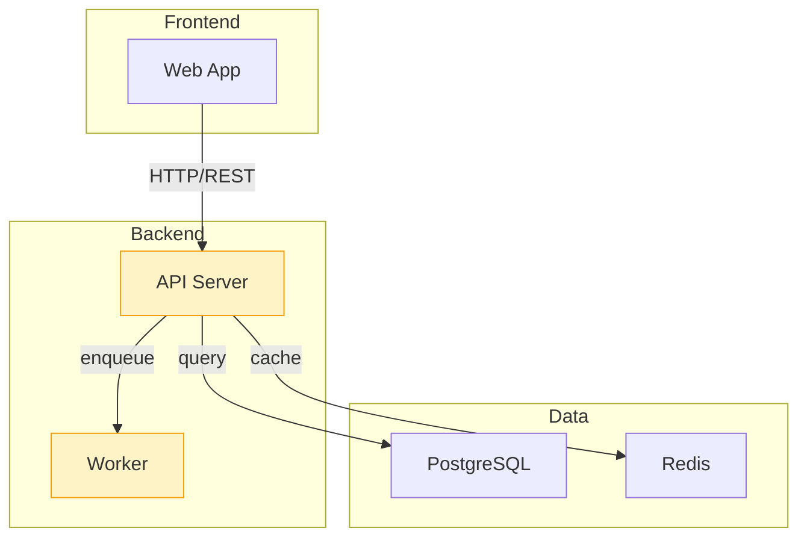
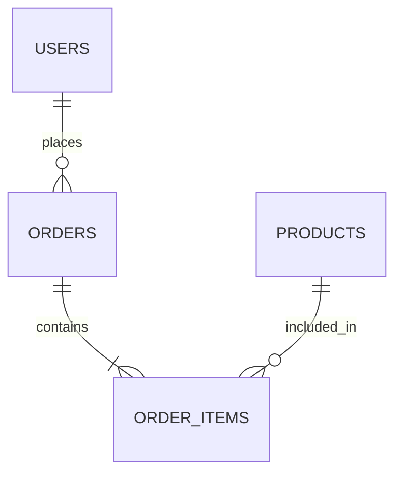
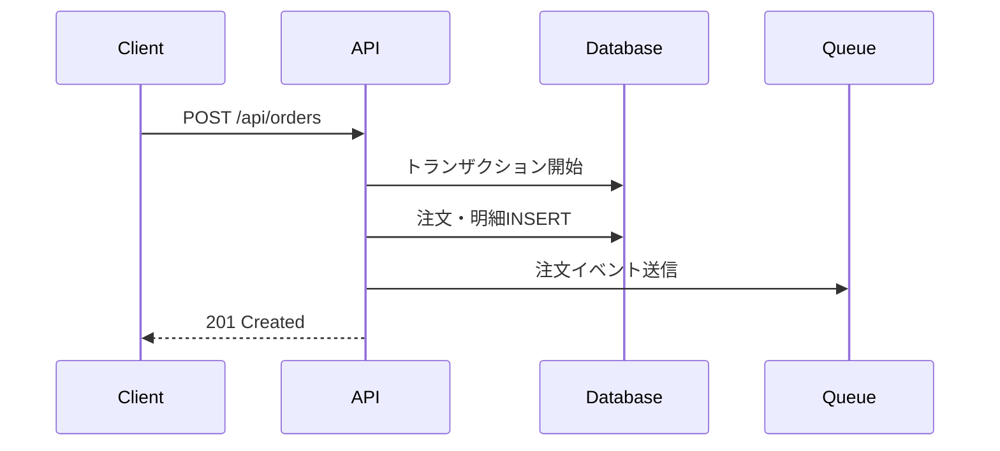
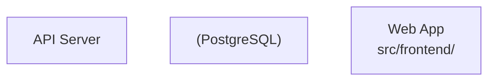

# PR Body Generator

AIに実装させた変更を**抽象度の階層構造で分析し、人間が機微を即座に知覚できるPR本文**を生成する。

---

## 原則

- **大きい地図から具体へ。** 抽象→具体を基本順序とする。ただし変更が小規模な場合や、読者にとって逆順が自然な場合は柔軟に構成を選べ
- **図と表で語れ。** 長文の説明より、Mermaid図とテーブルが優先
- **内部では疑って検証し、出力では事実を伝える。** 分析プロセスは厳しく、PR本文は冷静に
- **セクションはAIが判断する。** 変更に関係ないセクションは出力しない（ただしrequireは常に）
- **ゴールデンサークルを思考の指針に。** Why（なぜ必要か）→ How（どう解決したか）→ What（何を変更したか）の順で考えよ。ただし出力の形式やテンプレートとして固定するな。状況に応じた最適な構成を選ぶこと
- **前提知識ゼロで読めるように。** 専門用語は補足を添え、文脈が独立して完結するように書け

---

## タイトルガイド

PRタイトルはCS（カスタマーサポート）が確認することも想定し、**簡潔で分かりやすいタイトル**にする。

- **技術用語を並べるな。** `fix: null check in getUserById` ではなく `ユーザー詳細取得時のエラーを修正`
- **変更の本質を一言で。** 何が変わったか、誰に影響するかをCSでも理解できる言葉で
- **prefixは任意。** `fix:`, `feat:` 等のプレフィクスは既存の慣習に従う。強制しない
- **英語でも可。** リポジトリの慣習が英語の場合は英語で良い。ただし簡潔さは同様

---

## 実行フロー

### Step 0: 変更の全体像を掴む

```bash
# 変更ファイル一覧と行数
git diff --stat <base-branch>...HEAD

# 変更のあったディレクトリ構造
git diff --name-only <base-branch>...HEAD | sort
```

どのレイヤー（インフラ/バックエンド/フロントエンド/DB）に変更が集中しているか、規模感を把握する。

---

### Step 1: 階層型Perspective分析（内部思考プロセス）

以下の**5階層**から、変更内容に関連するものを選び、抽象度の高い順に分析する。この分析はPR本文にはそのまま出ない。本文を構成するための材料である。

#### 階層カタログ（抽象 → 具体）

| レベル | 階層名                 | 対象                                                      | 出力形式                           | いつ選ぶか                                       |
| ------ | ---------------------- | --------------------------------------------------------- | ---------------------------------- | ------------------------------------------------ |
| **L0** | システム構成           | 機能コンポーネント間の接続、インフラストラクチャ構成      | Mermaid図                          | 複数レイヤー・複数サービスに変更がある場合       |
| **L1** | データ構造             | ERD概要、データモデル、エンティティ間の関係               | Mermaid ERD + テーブル             | DBスキーマ・データモデルに変更がある場合         |
| **L2** | 通信・インターフェース | APIエンドポイント一覧、request/response仕様、イベント定義 | テーブル                           | API・イベント・メッセージングに変更がある場合    |
| **L3** | 処理フロー             | 各エンドポイントの処理フロー、外部連携、状態遷移          | Mermaidシーケンス図/フローチャート | 重要なビジネスロジック・外部連携に変更がある場合 |
| **L4** | 実装詳細               | DBカラム詳細、フロントエンド変更、インフラ設定詳細        | テーブル                           | 特定の実装の詳細を記録する必要がある場合         |

#### 各階層の分析内容（内部用）

各階層ごとに以下を整理する。

**L0: システム構成**
- 機能コンポーネントの全体像と接続関係
- インフラ構成（サーバー、ネットワーク、ミドルウェア）
- 変更があったコンポーネントの特定
- 境界の追加・削除・変更

**L1: データ構造**
- 追加・変更・削除されたエンティティ
- エンティティ間の関係（1:N、N:N）
- 主要なカラムとその意味
- データフローの概要（どこで生まれ、どこに格納されるか）

**L2: 通信・インターフェース**
- 追加・変更・削除されたAPIエンドポイント
- request/responseの主要フィールド
- 認証・認可の変更
- バージョニング・後方互換性

**L3: 処理フロー**
- 主要な処理の呼び出しチェーン
- 外部サービス連携のタイミングと内容
- エラーハンドリングの流れ
- 非同期処理・キューの存在

**L4: 実装詳細**
- 主要なカラムの型・制約・デフォルト値
- フロントエンドのコンポーネント構成
- 環境変数・設定ファイルの変更
- パフォーマンス関連の変更

#### 分析深度の判定

| 変更規模                            | 深度 | 内容                                  |
| ----------------------------------- | ---- | ------------------------------------- |
| 変更行数 < 50                       | 浅い | 関連する階層のdescriptionだけ         |
| 変更行数 50-200                     | 標準 | 関連する階層の全フィールド            |
| 変更行数 > 200 または 3レイヤー以上 | 深い | 全関連階層の全フィールド + コード抜粋 |

---

### Step 2: PR本文セクションの判定

分析結果に基づき、出力すべきセクションを判定する。

#### セクション判定ルール

| セクション         | 区分        | 出力条件                                                   |
| ------------------ | ----------- | ---------------------------------------------------------- |
| 変更概要           | **require** | 常に出力                                                   |
| 背景・課題・原因   | **require** | 常に出力                                                   |
| 影響範囲           | **require** | 常に出力                                                   |
| システム構成図     | optional    | L0の分析結果がある場合（複数レイヤー・サービスに変更）     |
| データ構造         | optional    | L1の分析結果がある場合（DB/データモデルに変更）            |
| API変更            | optional    | L2の分析結果がある場合（APIエンドポイントに変更）          |
| 処理フロー         | optional    | L3の分析結果がある場合（ビジネスロジック/外部連携に変更）  |
| 外部連携           | optional    | L3で外部サービスへの変更がある場合                         |
| フロントエンド変更 | optional    | L4でUI/UXの大きな変更がある場合                            |
| インフラ変更       | optional    | L0/L4でインフラ設定の変更がある場合                        |
| 設計判断           | optional    | 設計上の重要な判断・トレードオフがあった場合               |
| 設計上の検証       | optional    | 2つ以上の階層で分析した場合                                |
| 懸念点・技術的負債 | **require** | 常に出力（なければ「特になし」）                           |
| 今後の改善事項     | optional    | 改善事項がある場合                                         |
| Test Plan          | **require** | 常に出力                                                   |
| チェックリスト     | optional    | 破壊的変更・マイグレーション・環境変数変更等がある場合     |

---

### Step 3: PR本文の構築

判定されたセクションのみでPR本文を構築する。

``````markdown
## 変更概要

[1-2行で変更の本質を説明。何が変わり、なぜ変わったか]

## 背景・課題・原因

[なぜこの変更が必要だったか。背景事情と解決すべき課題]
[問題の根本原因が判明している場合は、その原因と導出過程を簡潔に記述]

## 影響範囲

[この変更が影響する範囲を明示。CSも読者を想定し、技術的詳細だけでなくユーザー視点の影響も含める]

- **影響モジュール**: [影響を受けるコンポーネント名]
- **ユーザーへの影響**: [UI/UXの変化、既存機能への影響有無]
- **データへの影響**: [既存データへの影響、マイグレーションの要否]
- **他サービスへの影響**: [連携サービスへの波及効果]

## システム構成図

[変更後のシステム全体像をMermaidで示す。変更箇所を視覚的に区別]



## データ構造

### ERD概要

[変更後のエンティティ関係をMermaidで示す]



### 変更されたエンティティ

| エンティティ | 変更内容   | 主要カラム                                |
| ------------ | ---------- | ----------------------------------------- |
| `users`      | カラム追加 | `email_verified_at`, `last_login_at`      |
| `orders`     | 新規作成   | `id`, `user_id`, `status`, `total_amount` |

## API変更

### エンドポイント一覧

| Method   | Path             | 変更 | 概要                                   |
| -------- | ---------------- | ---- | -------------------------------------- |
| `GET`    | `/api/users/:id` | 変更 | プロフィール情報に検証ステータスを追加 |
| `POST`   | `/api/orders`    | 新規 | 注文作成エンドポイント                 |
| `DELETE` | `/api/sessions`  | 削除 | 旧セッション管理APIを廃止              |

### 主要なRequest/Response

**`POST /api/orders`**

| フィールド       | 型            | 必須 | 説明           |
| ---------------- | ------------- | ---- | -------------- |
| `items`          | `OrderItem[]` | ✓    | 注文商品リスト |
| `payment_method` | `string`      | ✓    | 支払い方法     |

## 処理フロー

[主要な処理の流れをシーケンス図またはフローチャートで示す]



## 外部連携

| 外部サービス | 用途           | 変更内容                          |
| ------------ | -------------- | --------------------------------- |
| Stripe API   | 決済処理       | 新規統合。`stripe-node` v14を使用 |
| SendGrid     | 注文確認メール | 新規統合。テンプレートID `d-xxx`  |

## フロントエンド変更

| コンポーネント    | 変更内容                 | 影響           |
| ----------------- | ------------------------ | -------------- |
| `OrderForm.tsx`   | 新規作成                 | 注文入力画面   |
| `UserProfile.tsx` | 検証ステータス表示を追加 | 既存画面の拡張 |

## インフラ変更

| 対象                 | 変更内容            | 影響                   |
| -------------------- | ------------------- | ---------------------- |
| `docker-compose.yml` | Redisサービス追加   | ローカル開発環境に変更 |
| GitHub Actions       | E2Eテストジョブ追加 | CI実行時間が+3分増加   |

## 設計判断

[今回の実装で意識した設計ルール・判断基準]

- **[判断1]**: [内容] — [なぜそう判断したか、代替案との比較]
- **[判断2]**: [内容] — [なぜそう判断したか]

## 設計上の検証

[階層型分析の結果を要約]

- **システム構成**: [変更は既存の境界内で完結している / 新規コンポーネントを追加した]
- **データ構造**: [エンティティ関係に循環なし / 正規化は第3形準拠]
- **API**: [後方互換性を維持している / 破壊的変更あり（別途チェックリスト参照）]

## 懸念点・技術的負債

[正直に書く。なければ「特になし」で良い]

- **[懸念1]**: [内容] — [なぜ許容するか、または次回どう対応するか]

## 今後の改善事項

[今すぐ必須ではないが、将来対応すべきこと]

- [ ] [todo 1]
- [ ] [todo 2]

## Test Plan

### テスト項目

- [ ] [テスト項目1]: [期待結果]
- [ ] [テスト項目2]: [期待結果]

### 動作確認ポイント

- [ ] [確認ポイント1]
- [ ] [確認ポイント2]

### 自動テスト

```bash
# 実行コマンド例
```

## チェックリスト

- [ ] 既存APIの破壊的変更: [あり/なし]
- [ ] DBマイグレーション: [必要/不要]
- [ ] 環境変数の追加: [あり/なし]
- [ ] 他サービスへの影響: [あり/なし]
``````

---

## Mermaid記法ルール

**ノードラベルは必ずダブルクオーテーションで囲む。** これはルールであり、推奨ではない。

### 必須形式



### 禁止形式

```mermaid
graph TB
    API[API Server]        ← NG: クオーテーションなし
    Web[Web App\nsrc/]     ← NG: 改行を含むラベルでクオーテーションなし
```

### ルール詳細

- **`graph` / `flowchart` の全ノードラベル**: `id["Label"]` 形式を強制
- **改行を含むラベル**: 必ず `"Line1\nLine2"` 形式
- **特殊文字を含むラベル**（`/`, `:`, `-`, `()` 等）: 必ずダブルクオーテーション
- **エッジラベル**: `-->|"ラベル"|` 形式。クオーテーション必須
- **ER図**: エンティティ名はクオーテーション不要（`USERS ||--o{ ORDERS`）
- **シーケンス図**: `participant` 宣言の別名はクオーテーション不要（`participant A as API`）

---

## 出力ルール

- **HEREDOC形式で出力する。** `gh pr create --body "$(cat <<'EOF' ... EOF)"` 形式でそのまま使えるようにする
- **日本語で記述する**
- **図と表を優先する。** 長文の説明よりMermaid図とテーブルが優先
- **抽象→具体を基本とする。** L0→L1→L2→L3→L4の順を指針とするが、読者にとって自然な構成であれば柔軟に順序を調整して良い
- **関係ないセクションは出力しない。** optionalセクションは該当する場合のみ
- **requireセクションは常に出力する。** 「変更概要」「背景・課題・原因」「影響範囲」「懸念点・技術的負債」「Test Plan」は必須
- **懸念点は必ず書く。** 「特になし」でも明示する。書かないのは隠蔽と受け取られる
- **タイトルはCS視点で。** 簡潔で分かりやすい言葉を選ぶ

---

## 注意事項

- **pr.mdと組み合わせて使う。** pr.mdのStep 1-6（ブランチ作成〜push）を実行した後、Step 7（PR本文作成）を本スキルで代替する
- **module-boundary-designと併用せよ。** 責務分割の判断に迷った場合は `module-boundary-design` を参照し、その判断根拠を「設計判断」セクションに反映する
- **分析は内部に留める。** 階層ごとの分析結果をそのままPR本文に貼るな。統合して1つのストーリーにしろ
- **AIの自己評価を鵜呑みにするな。** 出力前に「この記述はコード差分と矛盾しないか」を自分で確認する
- **1万行を超える変更では、まずL0（システム構成）から始めよ。** 詳細に飛びつく前に、全体像を掴む
